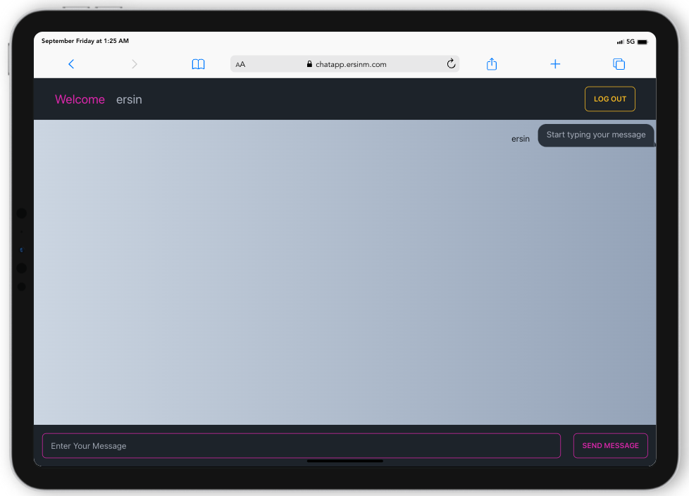

# Chat App

## Description

Chat App with React, Redux, Firebase, and Tailwind CSS.

## Features

- No login required
- Create chat rooms
- Real-time chat 
- Scroll to bottom

## Technologies

- React
- Redux
- Firebase
- Tailwind CSS
- React Scroll To Bottom

## Demo

[Live Demo](https://chatapp.ersinm.com/)

## Installation

1. Clone the repo
   ```sh
   git clone
   ```
2. Install NPM packages
   ```sh
   npm install
   ```
3. Create a Firebase project
4. Firebase project settings to .env file
   ```sh
   REACT_APP_API_KEY=
   REACT_APP_AUTH_DOMAIN=
   REACT_APP_PROJECT_ID=
   REACT_APP_STORAGE_BUCKET=
   REACT_APP_MESSAGING_SENDER_ID=
   REACT_APP_APP_ID=
   ```
5. Start the project
   ```sh
   npm start
   ```
6. Open http://localhost:3000 to view it in the browser

## License

Distributed under the MIT License. See `LICENSE` for more information.

## Contact

[Linkedin](https://www.linkedin.com/in/ersinm/)
[Email](mailto:ersin.mutlu@outlook.com.tr)
[Website](https://ersinm.com/)

## Acknowledgements

- [React](https://reactjs.org/)
- [Redux](https://redux.js.org/)
- [Firebase](https://firebase.google.com/)
- [Tailwind CSS](https://tailwindcss.com/)
- [React Scroll To Bottom](https://www.npmjs.com/package/react-scroll-to-bottom)

## Screenshots


